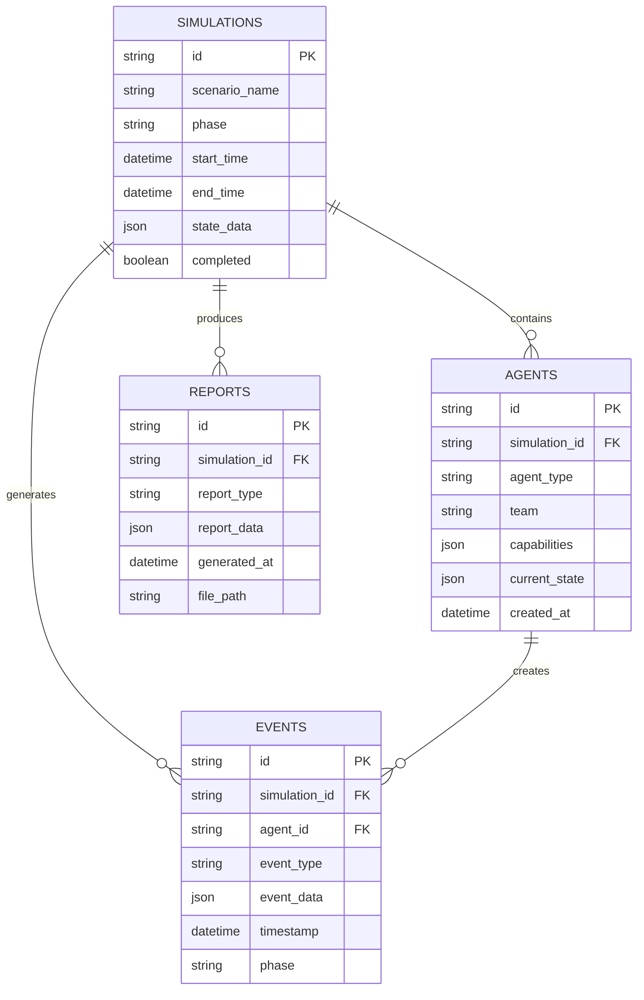

# Architecture Overview

## System Architecture

The Autonomous Multi-Agent Red/Blue Team Simulation System is built on a modular, event-driven architecture that enables coordinated multi-agent cybersecurity simulations.

## 🏗️ High-Level Architecture


## 🧩 Component Architecture

### 1. Orchestration Layer

#### Simulation Coordinator
```python
class SimulationCoordinator:
    """Main coordinator for the autonomous multi-agent simulation system."""
    
    def __init__(self):
        self.state = SimulationState()
        self.agents = {}
        self.mcp_servers = {}
        self.scenario = None
    
    async def initialize_simulation(self, scenario_name: str) -> None:
        """Initialize the simulation with a specific scenario."""
        
    async def run_simulation(self, timeout_minutes: int) -> None:
        """Run the main simulation loop."""
        
    async def generate_report(self) -> str:
        """Generate comprehensive simulation report."""
```

#### State Management
```python
@dataclass
class SimulationState:
    """Current state of the simulation."""
    simulation_id: str
    scenario_name: str
    phase: SimulationPhase
    start_time: datetime
    current_phase_start: datetime
    agents_active: Dict[str, BaseAgent]
    red_team_score: int
    blue_team_score: int
    attack_timeline: List[Dict[str, Any]]
    defense_timeline: List[Dict[str, Any]]
    critical_assets: Dict[str, Any]
    compromised_assets: List[str]
    detected_attacks: List[str]
    mitre_techniques_used: List[str]
    simulation_complete: bool
```

### 2. Agent Layer

#### Base Agent Architecture
```python
class BaseAgent:
    """Base agent class with LangChain integration and MCP client."""
    
    def __init__(self, agent_id: str, agent_type: str, system_prompt: str, 
                 tools: List[BaseTool], enable_mcp: bool = True):
        self.agent_id = agent_id
        self.agent_type = agent_type
        self.system_prompt = system_prompt
        self.tools = tools
        self.enable_mcp = enable_mcp
        
        # LangChain components
        self.llm = ChatAnthropic(model="claude-3-5-sonnet-20241022")
        self.memory = ConversationBufferWindowMemory(k=20)
        self.agent_executor = None
        
        # MCP client
        self.mcp_client = MCPClient() if enable_mcp else None
    
    async def execute_task(self, task: str) -> Dict[str, Any]:
        """Execute a task using the LangChain agent."""
        
    async def send_message(self, receiver_id: str, message_type: str, 
                          content: Dict[str, Any]) -> None:
        """Send message to another agent via MCP."""
        
    async def process_command(self, command: Dict[str, Any]) -> None:
        """Process command from coordinator."""
```

#### Agent Communication Flow


### 3. Communication Layer

#### MCP Server Architecture
```python
class MCPServer:
    """Main MCP server for inter-agent communication."""
    
    def __init__(self, host: str, port: int):
        self.host = host
        self.port = port
        self.registered_agents = {}
        self.message_queue = asyncio.Queue()
        self.active_connections = set()
    
    async def start_server(self) -> None:
        """Start the MCP WebSocket server."""
        
    async def register_agent(self, agent_info: Dict[str, Any]) -> None:
        """Register an agent with the server."""
        
    async def route_message(self, message: AgentMessage) -> None:
        """Route message to appropriate agent."""
        
    async def broadcast_message(self, message: AgentMessage) -> None:
        """Broadcast message to all agents."""
```

#### Message Protocol
```python
@dataclass
class AgentMessage:
    """Message structure for inter-agent communication."""
    id: str
    sender_id: str
    receiver_id: str
    message_type: str  # "command", "response", "alert", "status"
    content: Dict[str, Any]
    timestamp: str
    priority: str  # "low", "normal", "high", "critical"
    requires_response: bool
    metadata: Dict[str, Any] = field(default_factory=dict)
```

### 4. Data Layer

#### Database Schema


#### Vector Database Integration
```python
class VectorStore:
    """Vector database for agent memory and knowledge retrieval."""
    
    def __init__(self, persist_directory: str):
        self.embeddings = OpenAIEmbeddings()
        self.vectorstore = ChromaVectorStore(
            embedding_function=self.embeddings,
            persist_directory=persist_directory
        )
    
    async def add_agent_memory(self, agent_id: str, memory: str) -> None:
        """Add memory to agent's vector store."""
        
    async def retrieve_relevant_context(self, query: str, k: int = 5) -> List[str]:
        """Retrieve relevant context for query."""
        
    async def search_similar_scenarios(self, scenario_data: Dict) -> List[str]:
        """Search for similar historical scenarios."""
```

## 🔄 Data Flow Architecture

### Simulation Flow


### Agent Interaction Flow


## 🔧 Technology Stack

### Core Technologies
- **Python 3.8+**: Primary programming language
- **LangChain**: Agent framework and LLM integration
- **Claude 3.5 Sonnet**: Large Language Model provider
- **FastAPI**: API framework for MCP servers
- **Streamlit**: Dashboard and visualization
- **WebSockets**: Real-time communication

### Data Technologies
- **SQLite**: Primary database for simulation data
- **ChromaDB**: Vector database for agent memory
- **FAISS**: Vector similarity search
- **JSON**: Data serialization and configuration

### Communication Technologies
- **WebSockets**: Real-time agent communication
- **HTTP/REST**: API communication
- **Message Queues**: Asynchronous message handling
- **JSON Schema**: Message validation

### Security Technologies
- **Pydantic**: Data validation and serialization
- **Cryptography**: Encryption and secure communication
- **JWT**: Authentication tokens
- **OAuth 2.0**: API authentication

## 🚀 Deployment Architecture

### Development Environment


### Production Deployment


## 🔍 Monitoring and Observability

### Logging Architecture
```python
class StructuredLogger:
    """Structured logging for system observability."""
    
    def __init__(self, name: str):
        self.logger = logging.getLogger(name)
        self.setup_structured_logging()
    
    def log_agent_event(self, agent_id: str, event_type: str, 
                        details: Dict[str, Any]) -> None:
        """Log agent-specific events."""
        
    def log_simulation_event(self, simulation_id: str, phase: str,
                            event_type: str, details: Dict[str, Any]) -> None:
        """Log simulation-specific events."""
        
    def log_security_event(self, event_type: str, details: Dict[str, Any]) -> None:
        """Log security-related events."""
```

### Metrics Collection
```python
class MetricsCollector:
    """Collects and reports system metrics."""
    
    def __init__(self):
        self.metrics = {
            "agent_performance": {},
            "simulation_progress": {},
            "system_resources": {},
            "error_rates": {},
            "response_times": {}
        }
    
    def collect_agent_metrics(self, agent_id: str, metrics: Dict[str, Any]) -> None:
        """Collect agent performance metrics."""
        
    def collect_simulation_metrics(self, simulation_id: str, metrics: Dict[str, Any]) -> None:
        """Collect simulation progress metrics."""
        
    def export_metrics(self) -> Dict[str, Any]:
        """Export all collected metrics."""
```

## 🛡️ Security Architecture

### Security Layers


### Security Controls
- **Authentication**: API key-based authentication
- **Authorization**: Role-based access control
- **Input Validation**: Comprehensive input validation
- **Output Sanitization**: Output sanitization for safety
- **Encryption**: Data encryption at rest and in transit
- **Audit Logging**: Comprehensive audit trails
- **Rate Limiting**: API rate limiting
- **CORS**: Cross-origin resource sharing controls

## 📈 Performance Architecture

### Performance Optimization
```python
class PerformanceOptimizer:
    """Optimizes system performance."""
    
    def __init__(self):
        self.cache = {}
        self.connection_pool = asyncio.Queue()
        self.batch_processor = BatchProcessor()
    
    async def cache_agent_responses(self, agent_id: str, response: str) -> None:
        """Cache frequently used agent responses."""
        
    async def batch_process_messages(self, messages: List[AgentMessage]) -> None:
        """Process messages in batches for efficiency."""
        
    async def optimize_database_queries(self, queries: List[str]) -> None:
        """Optimize database queries for performance."""
```

### Scalability Considerations
- **Horizontal Scaling**: Multiple application instances
- **Database Sharding**: Database partitioning for large datasets
- **Caching**: Redis caching for frequently accessed data
- **Load Balancing**: Load balancer for traffic distribution
- **Asynchronous Processing**: Async processing for long-running tasks

## 🔄 Integration Architecture

### External Integrations


### API Architecture
```python
class APIGateway:
    """Gateway for external API integrations."""
    
    def __init__(self):
        self.rate_limiter = RateLimiter()
        self.auth_manager = AuthManager()
        self.request_validator = RequestValidator()
    
    async def handle_anthropic_request(self, request: Dict[str, Any]) -> Dict[str, Any]:
        """Handle requests to Anthropic API."""
        
    async def handle_mitre_request(self, request: Dict[str, Any]) -> Dict[str, Any]:
        """Handle requests to MITRE ATT&CK framework."""
        
    async def handle_threat_feed_request(self, request: Dict[str, Any]) -> Dict[str, Any]:
        """Handle requests to threat intelligence feeds."""
```

## 📋 Configuration Architecture

### Configuration Management
```python
class ConfigurationManager:
    """Manages system configuration."""
    
    def __init__(self):
        self.config = self.load_configuration()
        self.validators = self.setup_validators()
    
    def load_configuration(self) -> Dict[str, Any]:
        """Load configuration from multiple sources."""
        
    def validate_configuration(self, config: Dict[str, Any]) -> bool:
        """Validate configuration against schema."""
        
    def get_agent_config(self, agent_type: str) -> Dict[str, Any]:
        """Get configuration for specific agent type."""
        
    def get_scenario_config(self, scenario_name: str) -> Dict[str, Any]:
        """Get configuration for specific scenario."""
```

### Environment Configuration
- **Development**: Local development settings
- **Testing**: Test environment configuration
- **Staging**: Pre-production configuration
- **Production**: Production-ready configuration

## 🎯 Future Architecture Plans

### Scalability Enhancements
- **Microservices**: Break down into microservices
- **Event Streaming**: Use Kafka for event streaming
- **Distributed Caching**: Redis cluster for caching
- **Database Clustering**: Database clustering for high availability

### Feature Enhancements
- **Real-time Collaboration**: Multi-user simulation support
- **Advanced Analytics**: Machine learning for pattern analysis
- **Cloud Deployment**: Cloud-native deployment options
- **API Ecosystem**: Public API for third-party integrations

### Technology Upgrades
- **Containerization**: Docker containerization
- **Kubernetes**: Kubernetes orchestration
- **Service Mesh**: Istio service mesh
- **Observability**: Advanced observability stack

---

This architecture is designed to be modular, scalable, and maintainable while ensuring security and compliance with Australian regulations. The system supports both development and production deployments with appropriate monitoring and observability capabilities.
